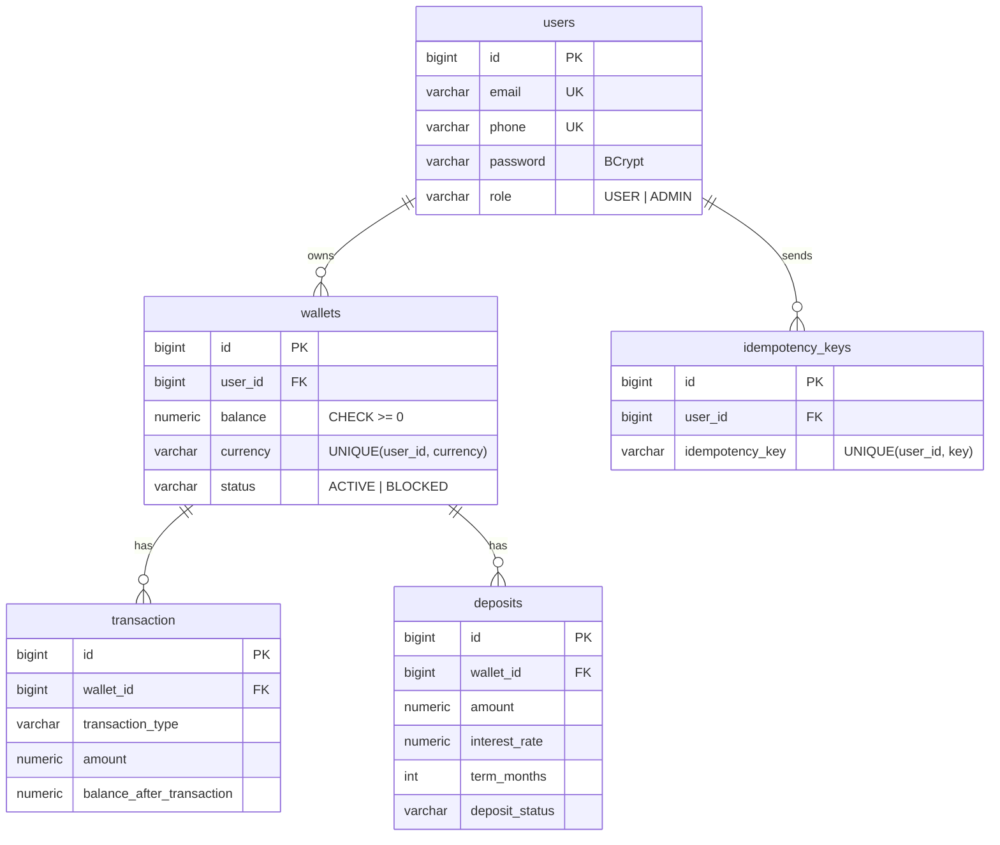

# Wallet Service

REST API электронного кошелька: регистрация и вход по JWT, мультивалютные кошельки,
пополнение и списание, переводы между пользователями, вклады с начислением процентов
и история операций.

## Стек

Java 24 · Spring Boot 4 · Spring Security (JWT) · Spring Data JPA / Hibernate · PostgreSQL ·
Flyway · MapStruct · Lombok · springdoc-openapi (Swagger) · JUnit 5 · Mockito · Testcontainers · Docker

## Быстрый старт

```bash
docker compose up --build
```

- API: http://localhost:8080
- Swagger UI: http://localhost:8080/swagger-ui.html. Нажмите **Authorize** и вставьте токен из `/api/users/login`.

Запуск из IDE: `docker compose up postgres`, затем `./mvnw spring-boot:run`.

Переменные окружения (у всех есть значения по умолчанию для локального запуска):

| Переменная | Назначение |
|---|---|
| `JWT_SECRET` | ключ подписи JWT, минимум 32 байта |
| `DB_PASSWORD` | пароль PostgreSQL |

## Пример сценария

```bash
# регистрация и вход
curl -X POST localhost:8080/api/users/register -H 'Content-Type: application/json' \
  -d '{"email":"alice@mail.com","password":"password1","phone":"+77010000001","firstName":"Alice","lastName":"Smith"}'

TOKEN=$(curl -s -X POST localhost:8080/api/users/login -H 'Content-Type: application/json' \
  -d '{"email":"alice@mail.com","password":"password1"}' | jq -r .token)

# кошелёк и пополнение
curl -X POST localhost:8080/api/wallets -H "Authorization: Bearer $TOKEN" \
  -H 'Content-Type: application/json' -d '{"currency":"KZT"}'
curl -X POST localhost:8080/api/wallets/1/top-up -H "Authorization: Bearer $TOKEN" \
  -H 'Content-Type: application/json' -d '{"amount":1000}'

# перевод (Idempotency-Key защищает от двойного списания при повторе запроса)
curl -X POST localhost:8080/api/transfer -H "Authorization: Bearer $TOKEN" \
  -H 'Idempotency-Key: 7f1c9a2e-0001' -H 'Content-Type: application/json' \
  -d '{"fromWalletId":1,"toWalletId":2,"amount":300}'
```

## API

Все эндпоинты, кроме регистрации и входа, требуют заголовок `Authorization: Bearer <token>`.
Пользователь видит и меняет только свои кошельки, вклады и транзакции (чужие → `403`).

| Метод | URL | Описание |
|---|---|---|
| POST | `/api/users/register` | регистрация |
| POST | `/api/users/login` | вход, возвращает JWT |
| GET / PATCH | `/api/users/me` | свой профиль |
| POST | `/api/wallets` | создать кошелёк (один на валюту) |
| GET | `/api/wallets` | мои кошельки |
| GET | `/api/wallets/{id}` | кошелёк |
| POST | `/api/wallets/{id}/top-up` | пополнение |
| POST | `/api/wallets/{id}/withdraw` | списание |
| POST | `/api/wallets/{id}/block`, `/activate` | блокировка и разблокировка (только `ADMIN`) |
| POST | `/api/transfer` | перевод между кошельками одной валюты |
| GET | `/api/transactions/wallet/{id}?page=0&size=20` | история операций (пагинация) |
| POST | `/api/deposits` | открыть вклад на 1–24 месяца |
| GET | `/api/deposits/{id}`, `/api/deposits/wallet/{id}` | вклад / вклады кошелька |
| POST | `/api/deposits/{id}/close` | закрыть вклад |

Ошибки возвращаются в едином формате:

```json
{ "status": 400, "message": "Validation failed", "errors": { "amount": "must be greater than or equal to 0.01" } }
```

Назначить администратора: `UPDATE users SET role = 'ADMIN' WHERE email = '...';`

### Проценты по вкладу

| Срок | Ставка, % годовых |
|---|---|
| 1–5 мес. | 8 |
| 6–11 мес. | 10 |
| 12–17 мес. | 15 |
| 18–24 мес. | 20 |

Проценты простые: `сумма × ставка × дни / 365`. При досрочном закрытии ставка снижается до 2%.

## Схема БД



Схемой управляет Flyway (`src/main/resources/db/migration`). Hibernate только сверяет сущности
со схемой при старте (`ddl-auto=validate`).

## Технические решения

- **Деньги в `BigDecimal`** и `NUMERIC(19,2)`: `double` не может точно хранить `0.1`.
- **Гонки при списании.** Кошелёк читается через `SELECT ... FOR UPDATE` (`@Lock(PESSIMISTIC_WRITE)`),
  поэтому параллельные операции с одним кошельком выполняются по очереди, и баланс не уходит в минус.
  В переводе кошельки блокируются в порядке возрастания id, чтобы встречные переводы A→B и B→A
  не попали в дедлок. Дополнительная защита: `CHECK (balance >= 0)` в самой БД.
- **Идемпотентность переводов.** Клиент может повторить запрос после тайм-аута. Повтор с тем же
  `Idempotency-Key` ничего не делает, а одновременный дубль получает `409`.
- **JWT без состояния.** В токене хранится id пользователя, а не email: смена email не ломает
  выданные токены. Роль читается из БД на каждом запросе, поэтому изменения применяются сразу.
- **Бизнес-правила в сущности.** `Wallet.debit()` и `Wallet.credit()` проверяют статус и баланс
  в одном месте, а сервисы их вызывают.
- **Ошибки.** `NotFoundException`, `ConflictException` и `BadRequestException` наследуют `ApiException`
  со статусом HTTP, а один `@RestControllerAdvice` превращает их в ответ.

## Тесты

```bash
./mvnw test   # нужен запущенный Docker (Testcontainers)
```

- **Unit** (JUnit 5 + Mockito): переводы, списания, расчёт процентов, проверка владельца, порядок блокировок.
- **Интеграционные** (Testcontainers + MockMvc, настоящий PostgreSQL): полный сценарий через HTTP,
  401/403, права администратора, идемпотентность, валидация.
- **Конкурентность:** 10 одновременных списаний по 100 с баланса 500 дают ровно 5 успешных и
  баланс 0. 40 встречных переводов проходят без дедлока, и сумма на кошельках сохраняется.
